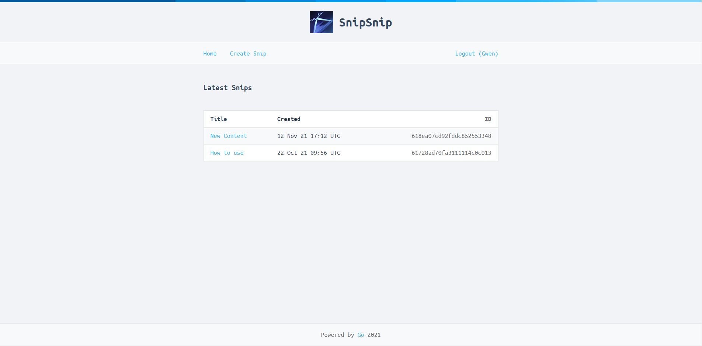

# Snip Snip

A small application similar to pastebin.
Users can paste & share snippets of text.

Built with Go using (mostly) the stdlib and HTML templating for a simple frontend.

The application is connected to a MongoDB cluster. Content created will get deleted automatically after the timeframe the user sets during creation.

The application also uses:
- HTTPS with a self signed certificate & specific TLS settings
- HTTP/2.0
- Cookies for session management
- CSRF protection w/ Token-based mitigation
- Middleware chaining
- Form validation

## Home view:

To be able to create content one needs to signup:

... or if already registered login:

After a successful login a user automatically gets redirected to the /create endpoint:

Feedback after successfully creating new content:

The new content now appears in the home view:

Clicking on it reveals the detail view:

